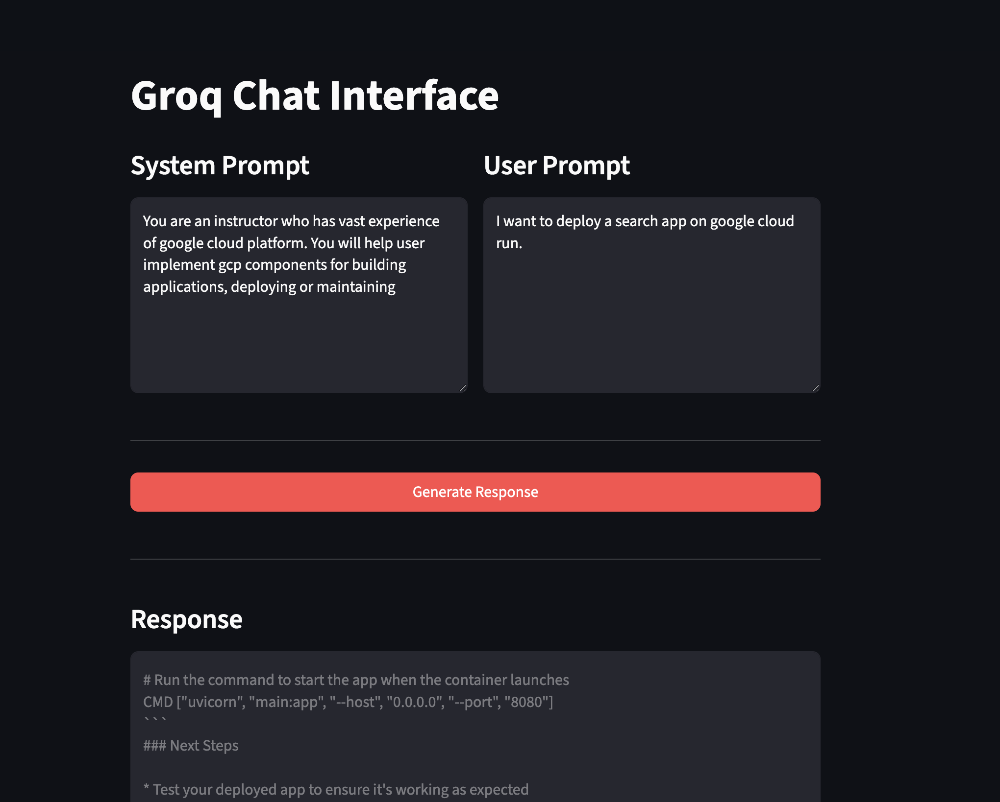

# Groq Chat Interface

A simple Streamlit application that provides a chat interface powered by the Groq API. Users can enter system prompts and user prompts to generate AI responses using LLaMA models.

## Features

- **Dual Prompt Interface**: Separate text boxes for system instructions and user queries
- **Groq API Integration**: Powered by Groq's fast inference with LLaMA 3.3 70B model
- **Base Instructions**: Pre-configured instructions that enhance all responses
- **Session State Management**: Responses persist during the session
- **Error Handling**: Validates API key and user input before making requests

## Project Structure

```
├── app.py          # Main Streamlit application
├── prompt.py       # Base instructions for the AI
├── .env            # Environment variables (API key storage)
├── screenshot.png  # App interface screenshot
└── README.md       # This file
```

## Installation

1. Clone or download this project
2. Install required dependencies:

```bash
pip install streamlit groq python-dotenv
```

3. Set up your Groq API key:
   - Get your API key from [Groq Console](https://console.groq.com)
   - Open the `.env` file
   - Replace `your_groq_api_key_here` with your actual API key:

```
GROQ_API_KEY="your_actual_api_key"
```

## Usage

Run the application:

```bash
streamlit run app.py
```

The app will open in your browser at `http://localhost:8501`

## How It Works

1. **System Prompt**: Enter custom instructions that guide how the AI should behave
2. **User Prompt**: Enter your specific question or message
3. **Generate Response**: Click the button to send both prompts to the Groq API
4. **View Response**: The AI-generated response appears in the response box below

## Technical Details

### API Configuration

- **Model**: `llama-3.3-70b-versatile`
- **Temperature**: 0.7 (balanced creativity)
- **Max Tokens**: 1024

### Base Instructions (`prompt.py`)

All requests include base instructions that ensure:
- Concise and clear responses
- Accurate information
- Professional tone
- Markdown formatting when appropriate

The system prompt you enter is appended to these base instructions.

### Message Structure

```python
messages = [
    {"role": "system", "content": f"{BASE_INSTRUCTIONS}\n\n{user_system_prompt}"},
    {"role": "user", "content": user_prompt}
]
```

## Requirements

- Python 3.7+
- streamlit
- groq
- python-dotenv

## Output


