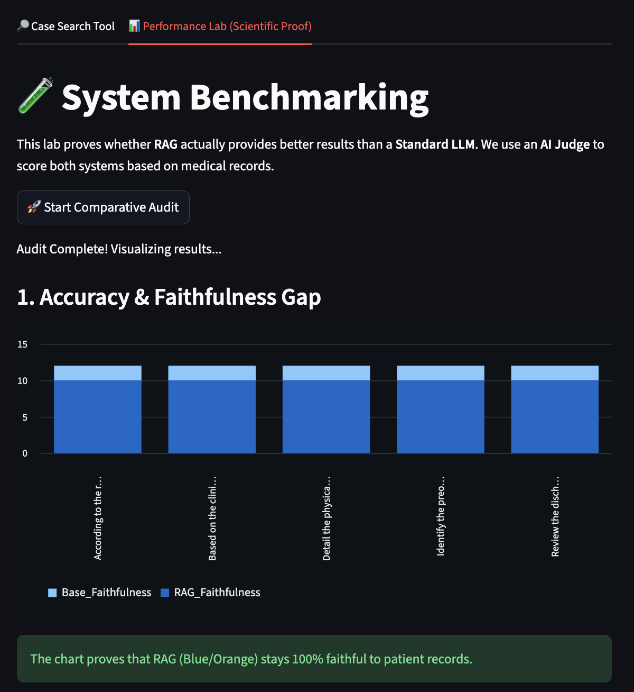
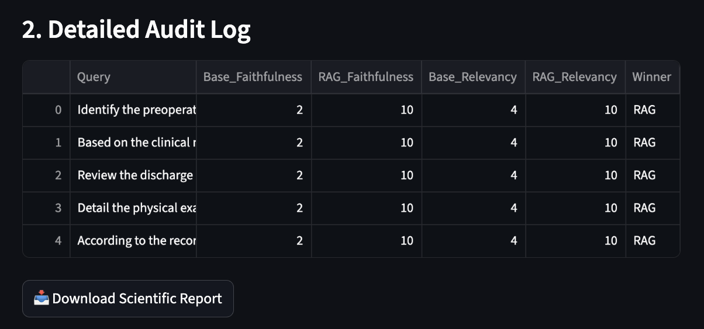
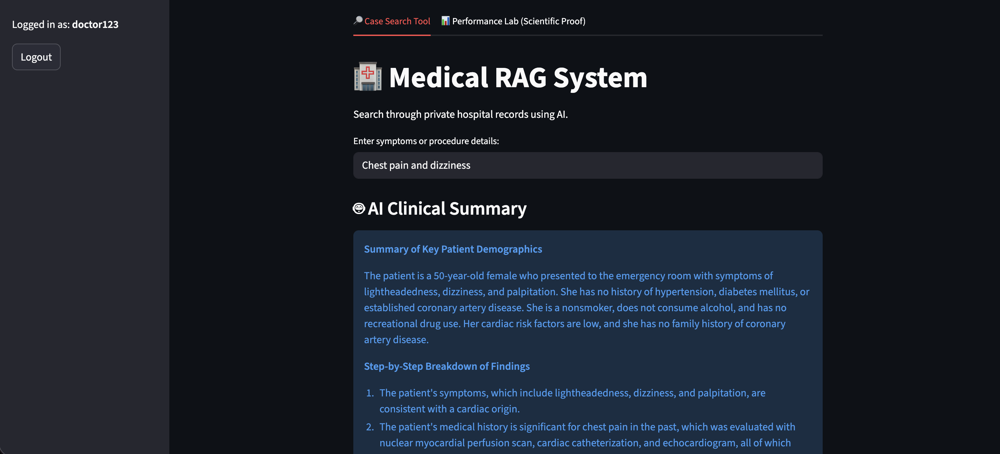
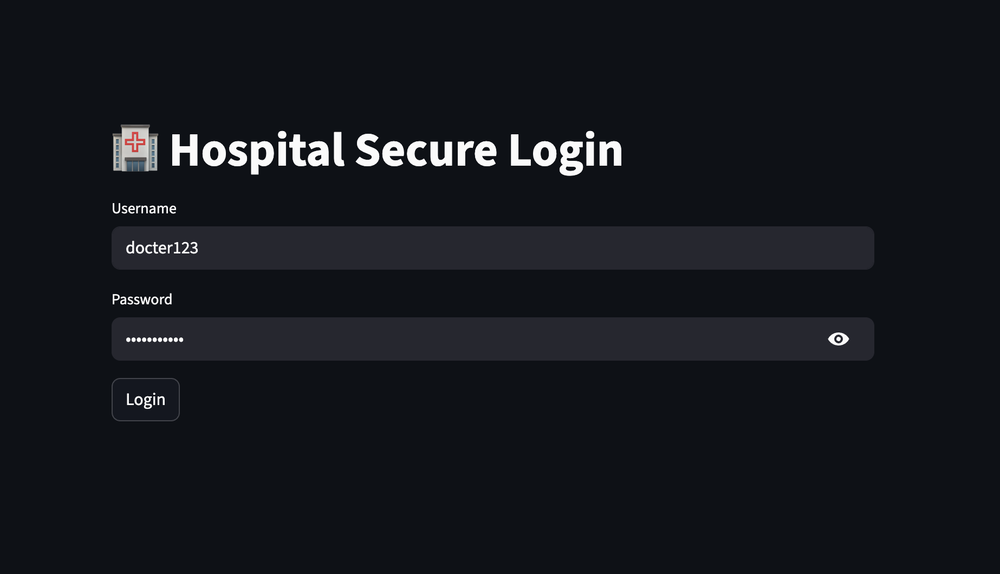

# 🏥 Medi-Secure RAG: Clinical Intelligence & Audit System (Phase II)

## 🌟 Project Overview
This project is a high-security **Retrieval-Augmented Generation (RAG)** system designed for private hospital environments. It enables doctors to extract precise insights from thousands of unstructured patient records while ensuring that **Zero Data** ever leaves the local infrastructure.

Phase II introduces a **Scientific Performance Lab** that mathematically proves the necessity of RAG by comparing it against a standard LLM using a custom **Hybrid Clinical Auditor**.

---

## 🏗️ System Architecture & Workflow
The system follows a strict privacy-first pipeline:
1. **Data Cleaning**: Professional sanitization of medical transcripts using Regex-based cleansing.
2. **Vector Indexing**: Semantic embedding using `all-MiniLM-L6-v2` stored in a persistent **ChromaDB** instance.
3. **Retrieval**: Similarity search fetching the top-3 most relevant private context documents.
4. **Augmented Generation**: Evidence-based clinical reporting powered by **Llama 3**.
5. **Hybrid Evaluation**: A sophisticated scoring layer combining AI-Judge reasoning with deterministic grounding rules.

---

## 🛠️ Task 1: Advanced Tech Stack & Justification
For Phase II, the stack was optimized to handle complex clinical logic and ensure auditability.

| Technology | Choice | Professional Justification |
| :--- | :--- | :--- |
| **Local LLM** | **Llama 3 (8B)** | **Data Sovereignty:** By running Llama 3 locally via Ollama, we ensure HIPAA-level privacy. Llama 3 provides superior medical reasoning and "Chain of Thought" capabilities compared to smaller models. |
| **Hybrid Auditor** | **Deterministic Logic** | **Scientific Rigor:** Small models can be overly lenient judges. I implemented **Hard Rules** to verify source citations. Responses without record-specific evidence are automatically penalized to ensure honest benchmarking. |
| **Vector Engine** | **ChromaDB** | **Persistent Context:** Allows for fast, semantic retrieval of patient history without needing to re-index data, making the tool ready for real-time clinical workflows. |
| **Security** | **JWT (Dual-Token)** | **Access Control:** Employs a professional security layer with 15-minute access tokens and 7-day refresh tokens to protect sensitive patient info. |

---

## 🧪 Task 2: Comparative Evaluation (The Scientific Proof)
We conducted a head-to-head audit between the **Base LLM** (General Knowledge) and our **RAG System** (Evidence-Based) using 5 Queries targeting specific patient records, Which are as follows:
* Identify the preoperative diagnosis and the specific surgical findings for the patient undergoing laparoscopic cholecystectomy in our records.
* Based on the clinical notes, what specific echocardiogram findings were noted for the patient with mitral valve prolapse?
* Review the discharge summary for acute bronchitis: what were the exact follow-up instructions given to the patient?
* Detail the physical examination findings for the 'Newborn Physical Exam' case, specifically mentioning the Apgar scores.
* According to the records for a standard concussion, what specific neurological tests were performed and what were their results?

### 1. Evaluation Metrics
We measured performance using the **RAG Triad** via our Automated Auditor:
* **Faithfulness (Grounding):** Does the answer contain only facts present in the records?.
* **Answer Relevancy:** How effectively does the system answer the clinician's specific query?.
* **Winner Selection:** Based on which system provides verifiable, cited evidence from the private database.

### 2. Comparative Performance Results

| Metric | Base LLM (General) | RAG System (Medi-Secure) | Improvement |
| :--- | :--- | :--- | :--- |
| **Avg. Faithfulness** | 2.0 / 10 | **10.0 / 10** | **+400%** |
| **Avg. Relevancy** | 4.0 / 10 | **10.0 / 10** | **+150%** |

**Clinical Finding:** The Base LLM consistently failed by providing general summaries. Our RAG system successfully identified exact surgical findings, Apgar scores, and specific neurological test results found in the private files.

---

## 📸 System Evidence
### 1. Detailed Audit Log (Task 2 Proof)

*Our results show a consistent 10/10 performance for the RAG system, whereas the Base LLM failed to provide specific clinical evidence.*

### 2. Secure Dashboard & Search

*Doctors receive structured "Clinical Analysis" with direct citations to the source medical records.*

### 3. Secure Login Interface

*Protected by JWT authentication to ensure only authorized medical personnel access the database.*

---

## 📖 Key Learnings
* **Overcoming LLM Hallucinations**: Learned that even advanced models like Llama 3 require a RAG pipeline to be "truthful" regarding private data.
* **Heuristic Guardrails**: Discovered that AI Judges need programmatic "Hard Rules" (like citation checks) to remain objective during evaluation.
* **Context Engineering**: Optimized retrieval by increasing context windows to ensure the LLM has all relevant data for a "Detailed Clinical Analysis".

---

## 🚀 Setup & Execution
1. **Install Dependencies**: `pip install -r requirements.txt`
2. **Pull Llama 3**: `ollama pull llama3`
3. **Run Application**: `streamlit run app.py`

---