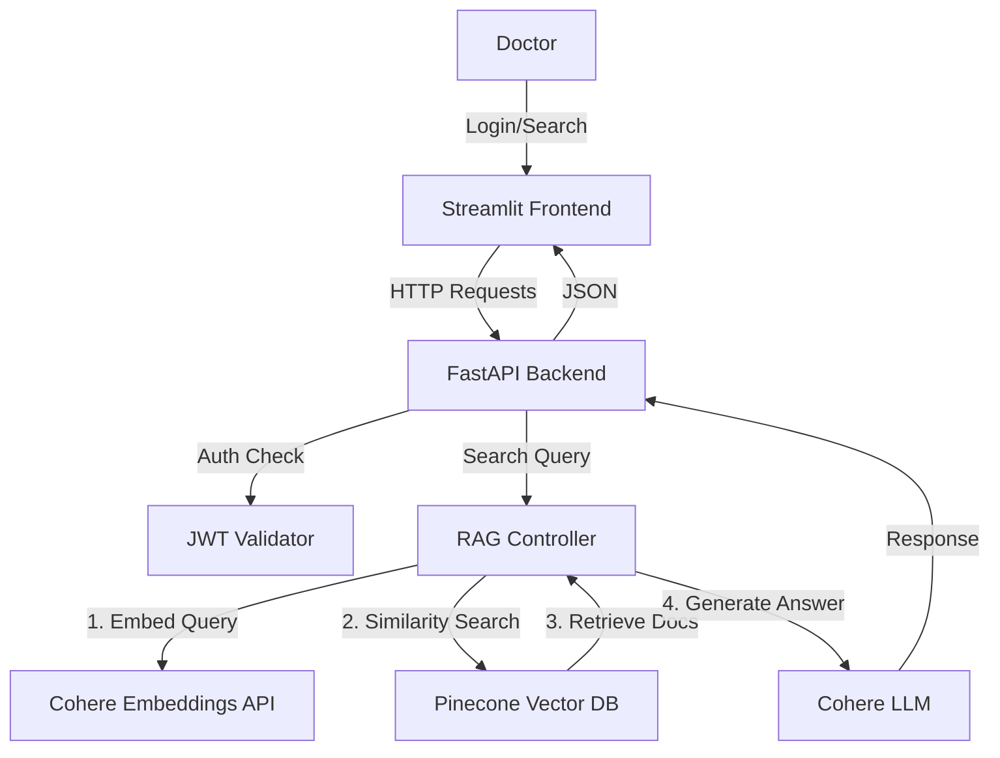

# Medical RAG System - Secure Patient Case Search

## 📋 Project Overview
A secure, AI-powered system designed for healthcare professionals to search through unstructured patient notes using natural language. The system leverages **Retrieval-Augmented Generation (RAG)** to find relevant past cases and Generate insights, protected by robust **JWT Authentication**.

---


## 🎥 Demo Video


## 🏗️ System Architecture



### Components
1.  **Frontend**: Built with **Streamlit**, offering a simple, interactive UI for login, search, and uploading cases.
2.  **Backend**: A high-performance **FastAPI** application handling validation, business logic, and RAG orchestration.
3.  **Authentication**: **JWT (JSON Web Tokens)** ensures only authorized users (Doctors/Admins) can access the system.
4.  **Vector Database**: **Pinecone** indexes patient case transcriptions for fast semantic retrieval.
5.  **AI Models**: **Cohere** provides both the Embedding model (`embed-english-v3.0`) and the Generative LLM.

---

## 🚀 Features
- **Semantic Search**: Find cases based on meaning (e.g., "patient with heart issues") rather than just keywords.
- **Secure Access**: Role-based access control using JWT. No unauthorized data access.
- **Document Upload**: Add new patient cases to the knowledge base instantly via the UI.
- **Dashboard**: Visual insights into case distribution and system usage.
- **Scalable Design**: Uses managed services (Pinecone, Cohere) for production-grade reliability.

---

## 🛠️ Tech Stack Justification

| Technology | Role | Justification |
|------------|------|---------------|
| **Python** | Core Language | Industry standard for AI/ML, vast ecosystem of libraries (LangChain, Pandas, NumPy). |
| **Streamlit** | Frontend | Enables rapid prototyping of data apps with minimal code, perfect for demonstrating AI capabilities without complex frontend frameworks. |
| **FastAPI** | Backend API | High-performance, async-native web framework with automatic Swagger documentation, ideal for serving ML models and handling concurrent requests. |
| **Pinecone** | Vector Database | Serverless, managed vector database that scales easily. Optimized for low-latency vector search, essential for RAG. |
| **Cohere** | Embeddings & LLM | Provides high-quality clinical/English embeddings (`embed-english-v3.0`) and reliable generation capabilities via API, avoiding the need for local GPU resources. |
| **LangChain** | Orchestration | Abstraction layer that simplifies connecting LLMs, vector stores, and document loaders, accelerating development time. |
| **JWT** | Security | Stateless authentication mechanism ensuring that only authorized personnel (doctors) can access patient data, meeting the "Secure" requirement. |

---

## 📂 Project Structure
```bash
rag_medical_papers/
├── backend/
│   ├── app.py           # FastAPI entry point & endpoints
│   ├── auth.py          # JWT authentication logic
│   ├── config.py        # Enviroment configuration
│   ├── data_loader.py   # Script to load CSV data to Pinecone
│   ├── database.py      # SQLite DB setup for User management
│   ├── models.py        # Pydantic data models
│   └── rag_system.py    # Core RAG logic (Pinecone + LangChain)
├── data/
│   └── mtsamples.csv    # Source dataset (medical transcriptions)
├── frontend/
│   ├── app.py           # Main Streamlit application
│   └── pages/           # Additional UI pages (Search, Dashboard, Upload)
├── .env                 # API Keys (Not committed)
├── requirements.txt     # Python dependencies
└── README.md            # Project documentation
```

---

## 🎓 Lessons Learned

1.  **RAG Pipeline Complexity**: Integrating disparate components (Vector DB, LLM, Embeddings) requires careful orchestration. LangChain simplifies this, but understanding the underlying flow is crucial for debugging.
2.  **Vector Dimension Mismatch**: One specific challenge encountered was ensuring the embedding model's output dimension (1024 for Cohere v3) matched the Pinecone index configuration. Mismatches lead to immediate API errors.
3.  **Security Integration**: Adding a security layer (JWT) adds complexity to the testing flow, but is non-negotiable for medical applications (HIPAA compliance).
4.  **Library Compatibility**: Rapidly evolving AI libraries often introduce breaking changes (e.g., `pinecone-client` v2 vs v3). Pinning versions is vital for stability.

---

## ⚡ Setup & Usage

### Prerequisites
- Python 3.9+
- API Keys for **Pinecone** and **Cohere**

### Installation
1.  **Clone the repository**:
    ```bash
    git clone <repository-url>
    cd rag_medical_papers
    ```
2.  **Set up Virtual Environment**:
    ```bash
    python -m venv venv
    source venv/bin/activate  # Windows: venv\Scripts\activate
    ```
3.  **Install Dependencies**:
    ```bash
    pip install -r requirements.txt
    ```
4.  **Configure Environment**:
    Create a `.env` file and add your keys:
    ```ini
    PINECONE_API_KEY=your_pinecone_key
    PINECONE_ENV=us-east-1
    COHERE_API_KEY=your_cohere_key
    SECRET_KEY=your_secret_key
    ```

### Running the System
**1. Initialize Data (First run only):**
```bash
python -m backend.data_loader
```

**2. Start Backend API:**
```bash
uvicorn backend.app:app --reload
```

**3. Start Frontend UI:**
```bash
streamlit run frontend/app.py
```

Visit **http://localhost:8501** to login and start searching!
