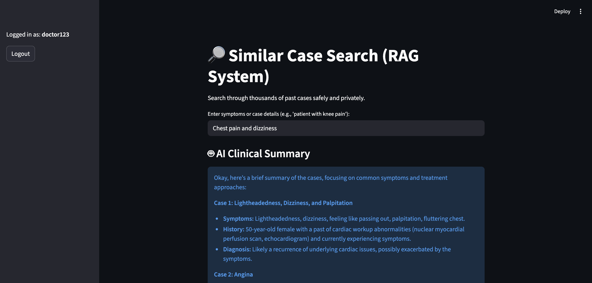
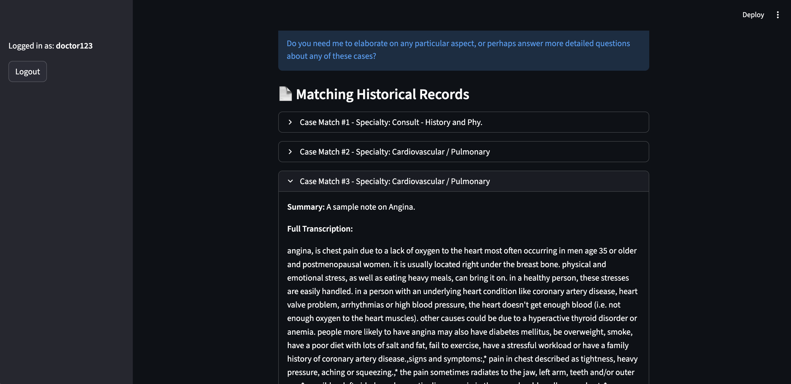

# 🏥 Secure Hospital AI System (Private RAG)

## 🌟 Project Overview
This is a professional-grade, high-security AI system designed for private hospitals. It allows doctors to search thousands of unstructured patient transcriptions to find similar past cases while ensuring **100% data privacy**. No data ever leaves the local system.

### Features:
1.  **Local SLM (Gemma 3:1b):** Uses Ollama to run AI locally. Data never touches the internet.
2.  **Advanced Security:** Implements a dual-token system (15-min Access / 7-day Refresh) using JWT.
3.  **Hybrid RAG:** Combines Semantic Search (meaning) with Metadata filtering (Specialty).
4.  **Data Engineering:** Deep cleaning of messy medical OCR text and "Silent Session Renewal."

---

## 🏗️ System Architecture

*The diagram above shows how patient notes are cleaned, turned into mathematical 'Fingerprints' (Embeddings), and stored in ChromaDB.*

---

## 🛠️ Tech Stack & Justification
| Technology | Role | Why we chose it? |
| :--- | :--- | :--- |
| **Streamlit** | Frontend | Rapid development of professional medical dashboards. |
| **ChromaDB** | Vector DB | Persistent, local storage of medical knowledge. |
| **Ollama (Gemma 3)**| Local SLM | Ensures total patient privacy; no cloud APIs used. |
| **JWT (PyJWT)** | Security | Industry-standard for protecting sensitive medical data. |
| **Pandas/Regex** | Data Eng. | Used to clean 'unstructured' and messy transcription notes. |

---

## 📸 System in Action
### 1. Secure Login

### 2. AI-Powered Search & Summarization

*The system provides a blue 'AI Clinical Summary' box to help doctors save time.*

---

## 📖 What I Learned
During this assignment, I mastered the **Modular Project Structure**, separating security, data processing, and AI logic. I learned how to handle **JWT Token Lifecycles** (Access vs Refresh) and the importance of **Data Sanitization** in medical NLP. Most importantly, I learned how to build a **Privacy-First RAG** system that complies with hospital security standards.

---

## 🚀 Setup Instructions
1. Install requirements: `pip install -r requirements.txt`
2. Install [Ollama](https://ollama.com) and run `ollama run gemma3:1b`.
3. Set up your `.env` file with a secret key. It should include variable - `JWT_SECRET=`, `CHROMA_DB_PATH=` & `MODEL_NAME=`
4. Run the app: `streamlit run app.py`