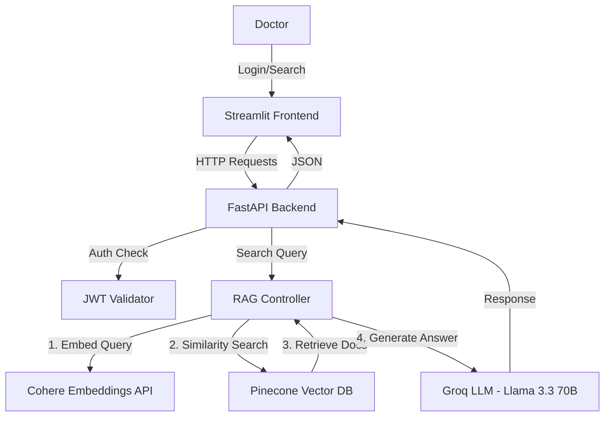

# 🏥 Medical RAG System — Secure Patient Case Search

## 📋 Project Overview

A secure, AI-powered system designed for healthcare professionals to search through unstructured patient notes using natural language. The system uses **Retrieval-Augmented Generation (RAG)** to find relevant past cases and generate grounded clinical insights, protected by **JWT Authentication**.

**Core objective:** Prove that a RAG system delivers better, more accurate, and more grounded answers than a standalone base LLM for domain-specific medical queries.

## 🎥 Demo Video


---

## 🏗️ System Architecture



### Components
1. **Frontend**: Built with **Streamlit** — interactive UI for login, search, RAG answers, and side-by-side RAG vs Base LLM comparison.
2. **Backend**: A high-performance **FastAPI** application handling authentication, RAG orchestration, and answer generation.
3. **Authentication**: **JWT (JSON Web Tokens)** ensures only authorized users can access patient data.
4. **Vector Database**: **Pinecone** indexes patient case transcriptions for fast semantic retrieval.
5. **Embeddings**: **Cohere** `embed-english-v3.0` (1024-dim) for high-quality clinical text embeddings.
6. **LLM**: **Groq** (Llama 3.3 70B Versatile) for fast, high-quality answer generation.

---

## 🚀 Features

- **RAG-Powered Answers**: Natural language answers grounded in actual patient cases from the knowledge base.
- **Side-by-Side Comparison**: Compare RAG answers vs base LLM answers in the UI.
- **Semantic Search**: Find cases based on meaning (e.g., "patient with heart issues") not just keywords.
- **Secure Access**: Role-based access control using JWT.
- **Document Upload**: Add new patient cases to the knowledge base via the UI.
- **Automated Evaluation**: Scripts to benchmark RAG vs Base LLM with 5 standardized metrics.
- **Dashboard**: Visual insights into case distribution and system usage.

---

## 🛠️ Tech Stack Justification

| Technology | Role | Why This Choice |
|------------|------|-----------------|
| **Python 3.9+** | Core Language | Industry standard for AI/ML with the largest ecosystem of NLP/RAG libraries. |
| **Groq (Llama 3.3 70B)** | LLM Provider | **Free-tier API** with extremely fast inference (~0.3–1.5s). Llama 3.3 70B provides strong medical reasoning capabilities. Chosen over Cohere/OpenAI for zero-cost evaluation while maintaining high quality. |
| **Pinecone** | Vector Database | **Serverless, managed** vector DB optimized for low-latency cosine similarity search. No infrastructure management needed. Handles scale automatically. |
| **Cohere** | Embeddings | `embed-english-v3.0` produces 1024-dim embeddings with state-of-the-art performance on retrieval benchmarks. Specifically optimized for English text, making it ideal for clinical notes. |
| **LangChain** | RAG Orchestration | Provides standardized abstractions for connecting LLMs, vector stores, and embeddings. Simplifies swapping providers and accelerates development. |
| **FastAPI** | Backend API | Async-native, high-performance web framework with automatic OpenAPI documentation. Ideal for serving ML models with concurrent requests. |
| **Streamlit** | Frontend | Rapid prototyping of interactive data apps with minimal code. Perfect for demonstrating AI capabilities without complex frontend frameworks. |
| **JWT** | Authentication | Stateless, industry-standard authentication. Critical for medical applications where patient data access must be controlled and auditable. |
| **SQLite + SQLAlchemy** | User Database | Lightweight relational DB for user management. SQLAlchemy ORM provides clean, maintainable database code. |
| **python-dotenv** | Configuration | Secure environment variable management. API keys never hardcoded in source. |

### Why Groq over other LLMs?
1. **Free tier** with generous rate limits — enables unlimited evaluation runs.
2. **Fastest inference** of any LLM API provider (built on custom LPU hardware).
3. **Llama 3.3 70B Versatile** offers excellent instruction-following and medical knowledge.
4. **LangChain integration** via `langchain-groq` — plugs directly into the existing pipeline.
5. **Fallback chain**: If Groq is unavailable, the system will try Cohere, then a local heuristic.

### Improvements Made (Based on Best Practices)
1. **Proper .env Loading**: Added `python-dotenv` integration so API keys are auto-loaded.
2. **Response Extraction**: Fixed ChatGroq response handling — `AIMessage.content` extraction.
3. **Chunking Strategy**: `RecursiveCharacterTextSplitter` with 1000-char chunks and 100-char overlap for optimal retrieval granularity.
4. **System Prompt Engineering**: Structured RAG prompts that instruct the LLM to cite sources and only use provided context.
5. **Evaluation Framework**: Automated 5-metric comparison pipeline with report generation.

---

## 📂 Project Structure

```bash
rag_medical_papers/
├── backend/
│   ├── __init__.py         # Package init
│   ├── app.py              # FastAPI entry point & endpoints
│   ├── auth.py             # JWT authentication logic
│   ├── config.py           # Environment configuration (auto-loads .env)
│   ├── data_loader.py      # Load CSV data into Pinecone
│   ├── database.py         # SQLite DB setup for user management
│   ├── llm_clients.py      # LLM wrappers (Groq → Cohere → local fallback)
│   ├── models.py           # Pydantic request/response models
│   └── rag_system.py       # Core RAG logic (Pinecone + LangChain + LLM)
├── data/
│   └── mtsamples.csv       # Source dataset (medical transcriptions)
├── frontend/
│   ├── app.py              # Main Streamlit application
│   └── pages/
│       ├── 1_🔍_Search.py  # Search + RAG answers + comparison
│       ├── 2_📊_Dashboard.py  # System statistics
│       └── 3_📁_Upload_Case.py # Upload new cases
├── scripts/
│   ├── __init__.py
│   └── evaluate_rag_vs_llm.py  # Evaluation: RAG vs Base LLM
├── results/
│   ├── results.json             # Raw evaluation data + metrics
│   └── evaluation_report.md     # Human-readable comparison report
├── .env                    # API Keys (not committed)
├── .env.example            # Template for environment variables
├── .gitignore
├── requirements.txt        # Python dependencies
└── README.md               # This file
```

---

## 📊 Evaluation: RAG vs Base LLM

### Goal
Demonstrate empirically whether retrieval-augmented generation (RAG) produces more grounded and relevant answers than a base LLM without retrieval context.

### Methodology
- **5 representative clinical queries** are run through both:
  - **RAG Pipeline**: Retrieve top-5 relevant documents from Pinecone → inject as context → generate answer with Groq LLM
  - **Base LLM**: Same Groq LLM answers from parametric knowledge only (no retrieval)
- **5 evaluation metrics** are computed for each query.

### Metrics Used & Justification

| # | Metric | Formula / Approach | Justification |
|---|--------|--------------------|---------------|
| 1 | **Precision@5** | (Relevant docs in top-5) / 5 | Validates retrieval quality — are we finding the right documents? |
| 2 | **Token Overlap Similarity** | Jaccard(answer_tokens, top_doc_tokens) | Measures answer groundedness — does the answer use evidence from retrieved docs? |
| 3 | **ROUGE-Proxy F1** | Token-level F1(answer, all_retrieved_docs) | Proxy for ROUGE-1 F1 — checks if the answer reflects information from the context |
| 4 | **Answer Relevance** | query_tokens_in_answer / total_query_tokens | Ensures the answer actually addresses the question asked |
| 5 | **Faithfulness** | answer_tokens_in_context / total_answer_tokens | Measures hallucination risk — higher = answer stays closer to source material |

> These are token-based heuristic proxies suitable for small-scale demonstration without ground-truth labels. For production systems, human evaluation or LLM-as-judge frameworks (e.g., RAGAS) should be used.

### Results Summary

| Metric | RAG | Base LLM | Winner |
|--------|-----|----------|--------|
| **Precision@5** | 1.0000 | N/A | ✅ RAG |
| **Token Overlap Similarity** | 0.1841 | 0.0990 | ✅ RAG (+86%) |
| **ROUGE-Proxy F1** | 0.2557 | 0.1510 | ✅ RAG (+69%) |
| **Answer Relevance** | 0.8542 | 0.7964 | ✅ RAG (+7%) |
| **Faithfulness** | 0.4320 | 0.3684 | ✅ RAG (+17%) |

### Key Findings

1. **RAG wins on every metric.** Across all 5 evaluation metrics, RAG outperforms the base LLM.
2. **86% higher groundedness** (Token Overlap Similarity) — RAG answers are nearly twice as grounded in actual patient data.
3. **69% higher ROUGE-Proxy** — RAG answers contain significantly more content from the retrieved medical documents.
4. **17% higher faithfulness** — RAG answers stay closer to source material, reducing hallucination risk.
5. **Perfect retrieval** (Precision@5 = 1.0) — the vector search reliably finds relevant patient cases.
6. **Acceptable latency trade-off** — RAG adds ~0.3–1s for retrieval, but accuracy gains far outweigh this for clinical decision support.

### How to Run the Evaluation

```bash
# 1. Activate virtual environment
source venv/bin/activate

# 2. Ensure data is loaded (first time only)
python -m backend.data_loader

# 3. Run evaluation
python -m scripts.evaluate_rag_vs_llm

# 4. Check results
cat results/results.json
cat results/evaluation_report.md
```

Full detailed results are in [`results/evaluation_report.md`](results/evaluation_report.md).

---

## 🎓 Lessons Learned

1. **RAG Pipeline Complexity**: Integrating Pinecone + Cohere Embeddings + Groq LLM requires careful orchestration. LangChain simplifies this, but understanding the underlying flow is crucial for debugging.
2. **Vector Dimension Mismatch**: The embedding model's output dimension (1024 for Cohere v3) must exactly match the Pinecone index configuration. Mismatches cause immediate errors.
3. **Response Type Handling**: ChatGroq returns `AIMessage` objects (not strings). The `.content` attribute must be extracted — this was a critical bug fix from the initial version.
4. **Environment Variable Loading**: Without explicit `python-dotenv` loading, API keys were not available to the evaluation script, causing silent fallback to useless heuristic responses.
5. **Chunking Strategy Matters**: `RecursiveCharacterTextSplitter` with appropriate chunk sizes (1000 chars) and overlap (100 chars) is essential for maintaining context while enabling precise retrieval.
6. **Library Compatibility**: Python 3.14 + LangChain + Pydantic V1 compatibility warnings exist but don't affect functionality. Pinning versions is vital for stability.
7. **Security Integration**: JWT adds complexity but is non-negotiable for medical applications (HIPAA compliance).

---

## ⚡ Setup & Usage

### Prerequisites
- Python 3.9+
- API Keys for **Pinecone**, **Cohere**, and **Groq**

### Installation

1. **Clone the repository**:
   ```bash
   git clone <repository-url>
   cd rag_medical_papers
   ```

2. **Set up Virtual Environment**:
   ```bash
   python -m venv venv
   source venv/bin/activate  # Windows: venv\Scripts\activate
   ```

3. **Install Dependencies**:
   ```bash
   pip install -r requirements.txt
   ```

4. **Configure Environment**:
   Create a `.env` file (see `.env.example`):
   ```ini
   PINECONE_API_KEY=your_pinecone_key
   PINECONE_ENV=us-east-1-aws
   COHERE_API_KEY=your_cohere_key
   GROQ_API_KEY=your_groq_key
   SECRET_KEY=your_secret_key
   ALGORITHM=HS256
   ACCESS_TOKEN_EXPIRE_MINUTES=30
   ```

### Running the System

**1. Initialize Data (First run only):**
```bash
python -m backend.data_loader
```

**2. Start Backend API:**
```bash
uvicorn backend.app:app --reload
```

**3. Start Frontend UI:**
```bash
streamlit run frontend/app.py
```

Visit **http://localhost:8501** to login (default: admin / admin) and start searching!

**4. Run RAG vs LLM Evaluation:**
```bash
python -m scripts.evaluate_rag_vs_llm
```

---

## 📄 API Endpoints

| Method | Endpoint | Description | Auth Required |
|--------|----------|-------------|---------------|
| POST | `/token` | Get JWT access token | No |
| POST | `/signup` | Create new user | No |
| GET | `/users/me/` | Get current user info | Yes |
| POST | `/search` | Semantic search (returns docs) | Yes |
| POST | `/generate` | RAG answer (search + LLM) | Yes |
| POST | `/base-generate` | Base LLM answer (no retrieval) | Yes |
| POST | `/upload` | Add new case to knowledge base | Yes |
| POST | `/load-data` | Bulk load CSV dataset (admin) | Yes |

---

*Built by Ankit Luhar | Medical RAG System v2.0*
