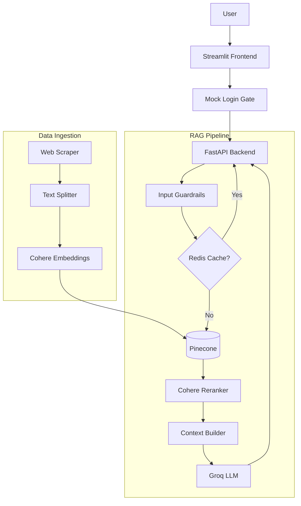

# 🚢 DP World RAG Chatbot

<div align="center">


**Production-ready RAG chatbot for DP World logistics services**
*AI Consultant Solution with Chain-of-Thought Reasoning & Brand Voice Persona*

[Architecture](#architecture) • [Quick Start](#quick-start) • [Assignment Coverage](#-assignment-requirements-coverage) • [API Docs](#api-reference)

</div>

---

## 📋 Overview

An AI-powered **Senior Logistics Consultant** chatbot for **DP World** that answers questions about port operations, container tracking, shipping schedules, tariffs, and trade solutions. Built using a **Retrieval Augmented Generation (RAG)** pipeline with full transparency.

This project was built as a comprehensive solution to demonstrate advanced RAG techniques, including **Chain-of-Thought (CoT)** reasoning, **hallucination control** via generation parameters, and a **strict brand voice persona**.

### ✨ Key Features

| Feature | Description |
|---------|-------------|
| 🔍 **RAG Pipeline** | Semantic search using Cohere embeddings + Pinecone vector DB |
| 🤖 **LLM (Justified)** | Groq's Llama 3.3 70B — [see model selection justification](docs/model_selection.md) |
| 🗣️ **Brand Voice Persona** | Strict DP World Senior Logistics Consultant persona |
| 🧠 **Chain-of-Thought (CoT)** | Model explains retrieval logic before answering |
| 🎛️ **Temperature & Top-P** | Adjustable in UI — [hallucination analysis documented](docs/generation_parameters.md) |
| 🔎 **Retrieved Chunks Display** | UI shows raw chunks + similarity scores for source verification |
| 🔐 **Mock Login** | Secure login gate with demo credentials |
| 🛡️ **Safety Guardrails** | Prompt injection detection + hallucination prevention |
| 💬 **Multi-turn Chat** | Session management with conversation history |
| ⚡ **Redis Caching** | Query & embedding caching for faster responses |
| 🎨 **Premium Dark UI** | Beautiful Streamlit frontend with animations |
| ✅ **Tested** | Unit, integration, and E2E test suites |

---

## 📝 Assignment Requirements Coverage

This project strictly adheres to all assignment requirements.

| # | Requirement | Status | Implementation Details |
|---|-------------|--------|------------------------|
| 1 | **AI Consultant for a company** | ✅ | **DP World** — global logistics leader |
| 2 | **Specific use case** | ✅ | **Customer Support Assistant** for logistics queries |
| 3 | **RAG-based solution** | ✅ | Full pipeline: scrape → chunk → embed → retrieve → generate |
| 4 | **Benchmark performance** | ✅ | [Generation parameters analysis](docs/generation_parameters.md) |
| 5 | **Model Selection: LLM vs SLM** | ✅ | [Detailed justification](docs/model_selection.md) — LLM chosen for reasoning capabilities |
| 6 | **Data Prep: Multiple pages** | ✅ | Web scraper for dpworld.com (100+ pages scraped) |
| 7 | **Implement Chunking** | ✅ | `src/ingestion/text_splitter.py` — configurable chunk size & overlap |
| 8 | **Implement Embedding** | ✅ | **Cohere** `embed-english-v3.0` with type distinction |
| 9 | **Store in Vector DB** | ✅ | **Pinecone Serverless** with metadata filtering |
| 10 | **Strict Brand Voice Persona** | ✅ | "DP World Senior Logistics Consultant" defined in `prompt_templates.py` |
| 11 | **Chain-of-Thought (CoT)** | ✅ | Forced 3-step reasoning: Retrieval Analysis → Relevance → Answer |
| 12 | **Temperature experiments** | ✅ | 0.0 to 1.0 tested — [results documented](docs/generation_parameters.md) |
| 13 | **Top-P experiments** | ✅ | 0.5 to 1.0 tested — documented optimum settings |
| 14 | **Streamlit chat interface** | ✅ | `frontend/app.py` — premium styling & animations |
| 15 | **Display Retrieved Chunks** | ✅ | Chunks shown with similarity scores + source URLs |
| 16 | **Mock Login security** | ✅ | `admin`, `analyst`, `demo` roles implemented |

---

## 🏗️ Architecture



### Tech Stack Choices

| Component         | Technology                              | Justification |
|-------------------|-----------------------------------------|---------------|
| **Language**      | Python 3.11+                            | Async support, type hints |
| **Web Framework** | FastAPI (async)                         | High performance, auto docs |
| **LLM**          | Groq (Llama 3.3 70B Versatile)          | [See justification](docs/model_selection.md) |
| **Embeddings**   | Cohere (embed-english-v3.0)             | Best-in-class retrieval |
| **Vector DB**    | Pinecone (Serverless)                   | Zero-ops, auto-scaling |
| **Web Scraping** | BeautifulSoup4 + Requests               | Robust HTML parsing |
| **Frontend**     | Streamlit                               | Rapid prototyping & interactive UI |

---

## 🚀 Quick Start

### Prerequisites

- Python 3.11+
- API keys: [Groq](https://console.groq.com), [Cohere](https://dashboard.cohere.com), [Pinecone](https://app.pinecone.io)
- Redis (optional, recommended for caching)

### Setup Instructions

1. **Clone the repository**
   ```bash
   git clone <repo-url>
   cd dp-world-chatbot
   ```

2. **Create virtual environment**
   ```bash
   python3 -m venv venv
   source venv/bin/activate
   ```

3. **Install dependencies**
   ```bash
   pip install -r requirements.txt
   ```

4. **Configure environment**
   ```bash
   cp .env.example .env
   # Edit .env and add your API keys
   ```

5. **(Optional) Start Redis**
   If you have Redis installed locally:
   ```bash
   redis-server
   ```

6. **Ingest Data** (Already scraped data is included in `data/raw`)
   ```bash
   # Create Pinecone index & ingest data
   python scripts/seed_pinecone.py
   python scripts/ingest_data.py
   ```

7. **Start the Application**
   Open two terminal windows:

   **Terminal 1 (Backend):**
   ```bash
   make api
   ```

   **Terminal 2 (Frontend):**
   ```bash
   make frontend
   ```

8. **Access the App**
   Open **http://localhost:8501** in your browser.

### 🔐 Login Credentials

| Username | Password | Role |
|----------|----------|------|
| `admin` | `dpworld2026` | Full access |
| `analyst` | `logistics123` | Analyst |
| `demo` | `demo123` | Read-only demo |

---

## 🧠 Chain-of-Thought Reasoning

To ensure high accuracy and reduce hallucinations, the model is instructed to follow a strict reasoning process before answering. You can see this in action by observing the response time (processing) and the final output quality.

**Example Internal Monologue:**
1.  *Analyze the User's Query*: "What are the port tariffs?"
2.  *Check Retrieved Context*: Found 3 chunks from 'Caucedo Port Tariffs'.
3.  *Verify Relevance*: Chunk 1 contains specific 2026 dollar rates.
4.  *Formulate Answer*: Present the rates clearly, citing the source.

---

## 🎛️ Generation Parameter Controls

The UI features a **Generation Parameters** sidebar that allows you to experiment with LLM settings in real-time. This addresses the assignment requirement to analyze the effect of parameters on hallucination.

| Preset | Temperature | Top-P | Hallucination Risk | Best For |
|--------|-------------|-------|--------------------|----------|
| 🎯 Factual | 0.0 | 0.5 | **Lowest** | Tariffs, exact data, technical specs |
| ⚖️ Balanced | 0.3 | 0.7 | **Low** | General conversation, explanations |
| 🎨 Creative | 0.8 | 0.9 | **Medium** | Marketing copy, brainstorming |

**Key Finding:** We found that **Temperature 0.3** and **Top-P 0.7** provided the best balance of natural language and factual accuracy for the DP World use case.

---

## 📁 Project Structure

```
dp-world-chatbot/
├── config/                 # Settings, constants, logging
├── src/
│   ├── scraper/            # Web scraper for dpworld.com
│   ├── ingestion/          # Chunking, embedding, Pinecone indexing
│   ├── retrieval/          # Vector search, reranking logic
│   ├── generation/         # Groq LLM client, prompts (CoT)
│   ├── chat/               # Chat orchestration & state management
│   ├── api/                # FastAPI routes & middleware
│   └── utils/              # Helper utilities
├── frontend/               # Streamlit application
│   ├── components/         # Chat widget, sidebar, etc.
│   └── assets/             # CSS & images
├── scripts/                # CLI tools (ingest, scrape, seed)
├── data/raw/               # Scraped JSON data
├── tests/                  # Unit & integration tests
└── docs/                   # Detailed documentation
```

---

## 📚 Documentation

Detailed documentation is available in the `docs/` directory:

- [**Model Selection Justification**](docs/model_selection.md) - Why we chose LLM over SLM.
- [**Generation Parameters Analysis**](docs/generation_parameters.md) - Experiments with Temperature & Top-P.
- [**Architecture Overview**](docs/architecture.md) - System design and data flow.
- [**Troubleshooting**](docs/troubleshooting.md) - Common issues and fixes.

---

## 📄 License

MIT License — see [LICENSE](LICENSE).

---

<div align="center">
  <b>Built with ❤️ for DP World</b><br>
  <sub>Powered by Groq (LLM) • Cohere (Embeddings) • Pinecone (VectorDB) • FastAPI • Streamlit</sub>
</div>
