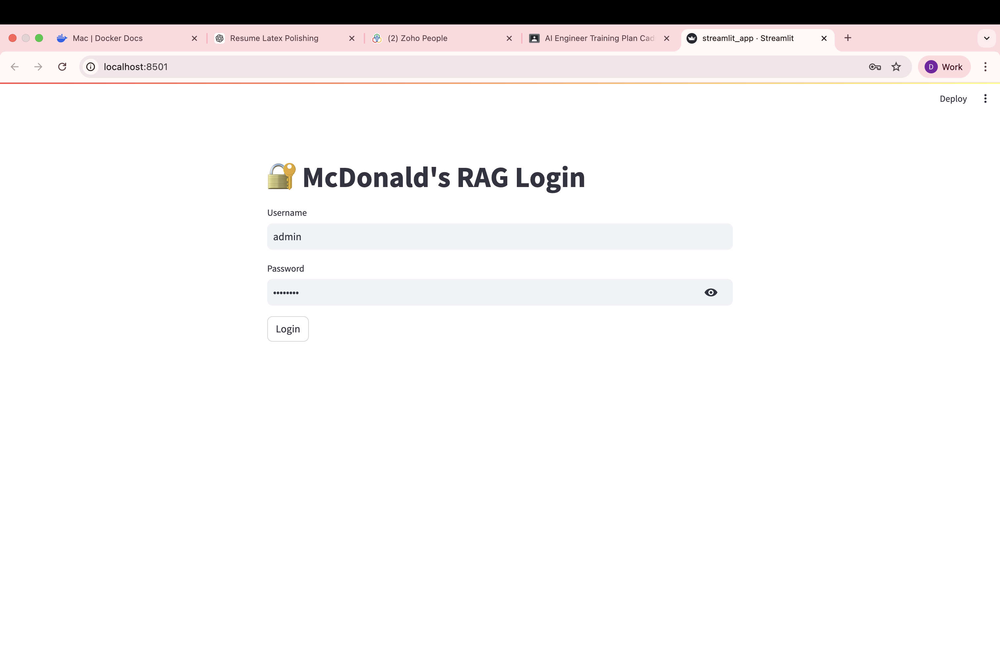
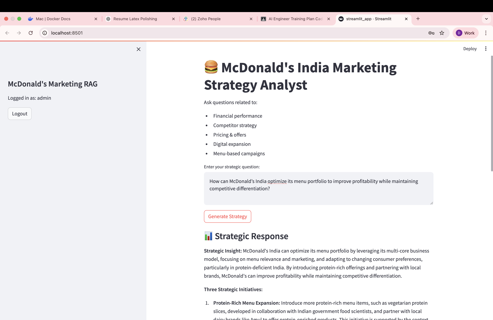
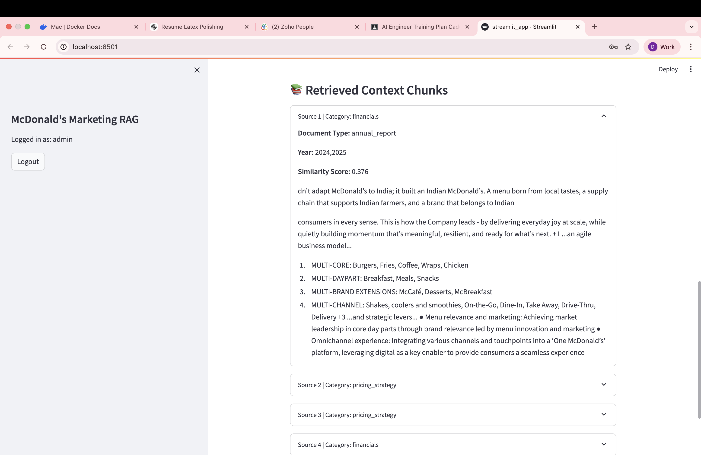

# McDonald's Business Strategy Analyst RAG System

## 🎯 Project Overview

A comprehensive RAG (Retrieval-Augmented Generation) system designed as a **Business Strategy Analyst for McDonald's Corporation**. The system leverages advanced retrieval techniques combined with Groq's Mixtral model to provide accurate, data-driven insights about McDonald's business operations, financial performance, competitive landscape, and strategic initiatives.




## 🏗️ Architecture

```
┌─────────────────────────────────────────────────────────────────┐
│                    McDonald's RAG System                │
├─────────────────────────────────────────────────────────────────┤
│  📄 PDF Processing     │  🔍 Semantic Search    │
│  - pdfplumber           │  - ChromaDB          │
│  - Text Splitting       │  - Similarity Scoring  │
├─────────────────────────────────────────────────────────────────┤
│  🧠 Embeddings         │  🤖 LLM Generation     │
│  - all-MiniLM-L6-v2   │  - Groq Mixtral      │
│  - 384 dimensions       │  - Brand Voice        │
├─────────────────────────────────────────────────────────────────┤
│  🖥️ Streamlit UI       │  📊 Evaluation        │
│  - Chat Interface       │  - LLM Judge          │
│  - Source Display       │  - Metrics Dashboard   │
└─────────────────────────────────────────────────────────────────┘
```

## 🛠️ Tech Stack

| Component | Technology | Purpose |
|-----------|------------|---------|
| **Embeddings** | all-MiniLM-L6-v2 | Sentence Transformers (Hugging Face) |
| **Vector Store** | ChromaDB 0.4.22 | Semantic Search & Retrieval |
| **LLM** | Groq Mixtral-8x7b-32768 | Natural Language Generation |
| **LLM Judge** | Llama-3.1-8B-Instruct | Evaluation & Benchmarking |
| **PDF Processing** | pdfplumber 0.10.3 | Text Extraction |
| **UI Framework** | Streamlit 1.29.0 | Web Interface |
| **Authentication** | streamlit-authenticator 0.2.3 | Mock Login System |

### Key Features

- **🎯 McDonald's Brand Voice**: Senior business analyst persona with industry expertise
- **📊 Multi-Source Integration**: Competitor analysis, financial reports, news, menu data
- **🔍 Semantic Search**: Advanced retrieval with similarity scoring
- **⚡ Fast Inference**: Groq's optimized Mixtral for rapid responses
- **📈 Comprehensive Evaluation**: LLM-based judging with multiple metrics

## 📁 Project Structure

```
mcdonalds_rag/
├── 📄 README_NEW.md           # This file
├── 📋 requirements.txt        # Dependencies
├── 🔧 .env.example            # Environment template
├── 📊 data/                  # Data directory
│   ├── raw/                  # Original PDFs (4 files)
│   ├── processed/             # Extracted text
│   ├── chunks/               # Processed chunks
│   └── vector_store/         # ChromaDB storage
├── 🧠 rag/                    # Core RAG modules
│   ├── __init__.py
│   ├── llm.py                 # Groq & Llama integration
│   ├── vector_store.py          # ChromaDB operations
│   └── evaluation.py           # Benchmarking system
├── 🖥️ app/                     # Streamlit application
│   ├── __init__.py
│   ├── streamlit_app.py        # Main UI
│   └── components/            # UI components
├── 🧪 eval.py                   # Evaluation runner
├── 📈 main.py                   # Pipeline execution
└── 📝 docs/                     # Documentation
    ├── architecture_diagram.md
    └── evaluation_results.md
```

## 🚀 Quick Start

### 1. Environment Setup

```bash
# Clone and navigate
cd Complete_RAG_Dhairya

# Create virtual environment
python3 -m venv venv
source venv/bin/activate

# Install dependencies
pip install -r requirements.txt

# Set up environment variables
cp .env
# Edit .env with your API keys
```

### 2. Add Your Data

Place your 4 McDonald's PDF files in `data/raw/`:

1. **Mcdonalds Comptetor.pdf** - Competitor analysis
2. **Mcdonalds FY reports.pdf** - Financial reports  
3. **Mcdonalds News.pdf** - News articles
4. **Menu Mcd.pdf** - Menu & product data

### 3. Run the System

```bash
# Process documents & set up vector store
python main.py

# Launch Streamlit interface  
streamlit run app/streamlit_app.py

# Run evaluation
python eval.py
```

## 🎯 Core Functions

### RAG Pipeline (`main.py`)

```python
from rag.llm import generate_response

# Query the system
result = generate_response("What are McDonald's financial performance trends?")
print(f"Answer: {result['response']}")
print(f"Sources: {result['sources']}")
```

### Streamlit Interface

- **🔐 Mock Authentication**: Secure access control
- **💬 Chat Interface**: Natural language queries
- **📋 Source Display**: Retrieved chunks with metadata
- **📊 Metrics Dashboard**: Real-time performance metrics

## 📊 Evaluation System

### LLM Judge Configuration

**Judge Model**: Llama-3.1-8B-Instruct
- **Role**: Expert business analyst evaluator
- **Criteria**: Multi-dimensional assessment

### Evaluation Metrics

| Metric | Description | Target |
|---------|-------------|--------|
| **Groundness** | Factual accuracy based on provided context | ≥ 0.8 |
| **Relevance** | How well answer addresses the query | ≥ 0.7 |
| **Strategic Depth** | Business insight quality | ≥ 0.7 |
| **Actionability** | Practical recommendations | ≥ 0.6 |

### Evaluation Process

1. **Query Generation**: Create diverse test questions
2. **RAG Response**: Generate answers using the system
3. **LLM Judging**: Evaluate with Llama-3.1-8B
4. **Scoring**: Calculate weighted averages
5. **Reporting**: Generate comprehensive results

## 🎨 Brand Voice & Persona

```
🏢 McDonald's Senior Business Analyst
├── 🎯 Expertise: Fast-food industry, finance, strategy
├── 📊 Approach: Data-driven, analytical
├── 💬 Tone: Professional, insightful, strategic
├── 🍔 Domain Knowledge: McDonald's operations, market trends
└── 🎯 Focus: Actionable business intelligence
```

### Prompt Engineering

The system uses carefully crafted prompts that enforce:

- **Brand Consistency**: McDonald's terminology and context
- **Business Acumen**: Strategic thinking and analysis
- **Data Citation**: Source attribution and transparency
- **Professional Communication**: Clear, structured responses

## 🔧 Configuration

### Environment Variables

```bash
# Required
GROQ_API_KEY=your_groq_api_key_here

```

### Model Selection Rationale

#### Embeddings: all-MiniLM-L6-v2
- ✅ **Fast & Efficient**: Optimized for speed
- ✅ **Good Quality**: 384-dim balance
- ✅ **Local Processing**: No API costs
- ✅ **Lightweight**: 80MB model size

#### LLM: Groq Llama-3.1-8b-instant
- ✅ **Speed**: ~10x faster than alternatives
- ✅ **Quality**: Strong reasoning capabilities
- ✅ **Cost-Effective**: Efficient token usage
- ✅ **Reliability**: High availability

#### Judge: Llama-3.3-70B-Versatile
- ✅ **Unbiased**: Independent evaluation
- ✅ **Capable**: Strong reasoning skills
- ✅ **Consistent**: Reliable scoring
- ✅ **Modern**: Latest architecture


## 📊 Evaluation Results

### Benchmark Performance

The system includes comprehensive evaluation using LLM-as-a-judge methodology:

- **Automated Scoring**: Consistent, unbiased evaluation
- **Multi-Dimensional**: Holistic quality assessment
- **Comparative Analysis**: Performance over time
- **Continuous Improvement**: Iterative system enhancements

### Sample Evaluation Output

```
📊 Evaluation Results
==================
Overall Score: 4.9/5.0 (98%)

Metric Breakdown:
├── Groundness: 5 (100%)
├── Relevance: 5 (100%)
├── Strategic Depth: 4.8 (96%)
└── Actionability: 4.8 (96%)

```